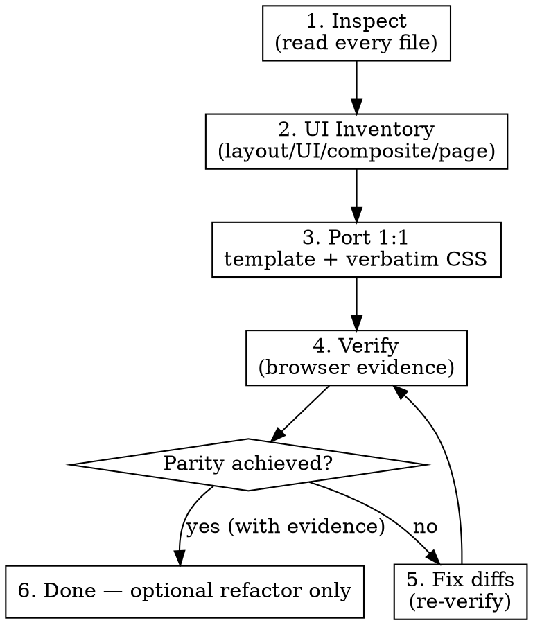

# UI Prototype Migration

## Mission

Take an **existing HTML/CSS UI prototype** (the design is already done) and
migrate it into a **component-based framework** — Vue 3 first — while
reproducing the prototype's rendered output value-for-value and behavior-for-behavior.

The prototype is the **visual and behavioral source of truth**. Your creativity
goes into component boundaries, clean framework code, and verification — **never
into a different visual design**.

> **Do not redesign the prototype. Migrate it.**

## The one rule that overrides everything

You may change the prototype's visual output only when the user explicitly asks.
Compiling, tests passing, or "the classes match 1:1" prove **nothing** about
fidelity. Visual parity is an **acceptance criterion**, proven with browser
evidence — not an optional polish step.

**Violating the letter of these rules is violating the spirit of these rules.**

## When to use / not use

**Use** when you have a finished HTML/CSS prototype (files, or a running page you
can read the source of) and a target app to port it into.

**Do NOT use** this skill for: designing a new UI from a spec/screenshot,
Figma-to-code generation, "make this UI better", or building a design system.
Those are design-generation tasks; this skill preserves an existing design.

## The non-negotiables

These are the failure modes agents actually fall into. Each is forbidden:

| Temptation | Why it's a migration failure |
| --- | --- |
| "I'll convert the CSS to Tailwind — it's basically the same" | Utility classes snap continuous values (`18px`) to discrete steps (`16px`). That **changes the render**. Tailwind is a later, optional, re-verified phase — never the first pass. |
| "The build passes and classes match 1:1, so it must look right" | Code-level reasoning is not visual verification. You must compare the **render** in a browser. |
| "It builds and renders without console errors" | That is a smoke check, not parity. Done requires a **passing visual-diff** (0 real computed-value/geometry diffs), per view × theme × viewport. |
| "I co-located the CSS into scoped blocks — that's just refactor" | Co-location changes resolved styles (scope specificity; slotted content stops matching — e.g. `.btn svg` no longer hits a slotted icon, collapsing it to 0 width). It **requires a fresh full visual-diff** before you re-claim parity. |
| "I'll leave it all in one global style.css / one big component — co-locating later" | **No.** Phase 3 ends with every component owning its own `<style scoped>` (global only tokens/base/shell/shared atoms) — a monolithic file or a single mega-component is not "porting, refactor later", it's an incomplete migration. Co-locate in Phase 3, then re-verify. |
| "Looks good." | Not evidence. Report concrete diffs with screenshots + style measurements. |
| "This element exists, so I'll make it a component" / "I'll build a generic reusable `<UiTag>`" | Both over- and under-componentization break the contract. Extract only on real reuse/behavior/responsibility. |
| "I'll quietly add a small improvement" (an extra `v-model`, a transition, a nicer icon) | Silent invention. If the prototype doesn't specify it, don't add it — flag the ambiguity instead. |
| "I'll swap in a UI-library component, it looks similar" | Its padding/radius/shadow differ. Never substitute for "similar". |
| "I'll skip the responsive/interaction checks" | Behavior is part of the contract. Verify every breakpoint and state. |

For the full rationale and exact-value rules, read
[references/css-preservation.md](references/css-preservation.md).

## Workflow

Follow these phases in order. Do **not** jump to implementation before Inspect &
Inventory are done.

### Phase 1 — Inspect (before writing any code)

Read **every** relevant file. Record findings. Do not start coding first.

> **Prototype given only as a running URL (no source files)?** Extract the
> source of truth *first* — the live DOM, every computed CSS rule, assets,
> and media queries — using browser automation (Playwright/DevTools) and save
> it locally. Treat that extracted snapshot as the prototype from then on. Do
> not guess the markup/styles from a screenshot.

- All HTML pages; page-to-page relationships (links, nav).
- All CSS files + `<style>` blocks + inline `style=""` (inline wins on specificity).
- Design tokens / CSS custom properties (`:root`, `@theme`).
- `@media` / `@supports` / `@container` rules and their breakpoints.
- All JS — every interaction, state class, and handler.
- Assets: images, SVGs, icons, icon fonts, logos, local fonts.
- Typography: family, weights, sizes, line-height, letter-spacing.
- Interactive states: hover/focus/active/disabled/selected/loading/open.

If migrating into an **existing target app**, also inspect it first: its
directory layout, naming, styling approach, routing, and existing components.
**Host-project conventions override these defaults** wherever they conflict.

### Phase 2 — Build a UI Inventory

Classify what the prototype *actually contains* (don't invent categories):

- **Layout primitives** — shell, header/topbar, sidebar, nav, content container, grid.
- **UI primitives** — button, input, badge, avatar, pill, icon button.
- **Composite components** — search bar, stat card, data table, dropdown/menu, tabs, modal.
- **Page-level structures** — dashboard, users, settings, detail.

For each, note **where it appears and how many times**. Repetition drives
extraction. See [references/componentization.md](references/componentization.md).

### Phase 3 — Port 1:1 (parity first)

Move HTML into framework templates nearly 1:1 and carry the CSS over **verbatim**,
in two sub-steps:

1. **Reach a running target fast** — templates + the prototype's CSS (a single
   global import is fine for this step) + reproduced JS interactions. Get to raw
   parity before optimizing structure.
2. **Co-locate** each component's rules into its own `<style scoped>` (global only
   tokens / base / app-shell layout / shared atoms) — do **not** ship one
   monolithic global file. Scoping shifts specificity and silently breaks
   slotted-content rules, so **run a fresh full visual-diff immediately after
   co-locating**; raw parity from step 1 does not survive co-location unverified.

Componentize **faithfully, not speculatively** (this reconciles with
[componentization.md §Phase timing](references/componentization.md#phase-timing-precisely)):
extract a component in Phase 3 when the prototype *demonstrates* reuse (≥2) or a
bounded variant set, mapping 1:1 to existing markup/CSS — that is porting, not
abstraction. Do NOT invent primitives, variants, slots, or a design system the
prototype doesn't exercise (those are Phase 6). Preserve semantic tags, class
names, and element ids. Do NOT convert to utility CSS or introduce libraries.
Framework specifics: [references/framework/vue.md](references/framework/vue.md).

### Phase 4 — Verify (mandatory, evidence-based)

Run **both** prototype and target, then compare the render at the prototype's own
viewports and states. Combine:

- **Pixel diff** (screenshots) as the alarm that *something* drifted — with real
  baseline + threshold + flake hygiene, not a naive one-shot diff.
- **Computed-style + bounding-box diff** as the diagnosis of *which value* differs.
- **Accessibility diff** (axe-core): the target must add **no new** violations vs
  the prototype — inherited debt is documented, not silently "fixed".

Cover **every combination** — each view × {light, dark if the prototype has it} ×
each breakpoint viewport. Missing any combination = incomplete, not "done".
Interactions are **mandatory, not optional**: verify hover/focus/active/disabled/
open-closed/selected for each interactive element. A clean resting-state diff
alone is not parity — the bundled script is resting-state only, so drive
interactions with small Playwright snippets (or manual capture). Full method +
automation: [references/visual-verification.md](references/visual-verification.md).

### Phase 5 — Iterate until parity

Fix concrete differences, re-verify, repeat. **Compare per view** (navigate both
prototype and target to each route before capturing — an all-in-DOM prototype
vs a route-mounted SPA otherwise produces false "missing" hits). Run the diff
for each view × theme × viewport; keep going until `verify-parity.mjs` (or
equivalent) reports **0 real computed-value/geometry differences**. Ignore
selectors that belong to other views on a given capture, but treat every
computed-value/geometry diff as real and fix it.

Done = a passing visual-diff with evidence — **not** a clean build or "renders
without errors" (see [references/visual-verification.md](references/visual-verification.md#what-done-means)).

### Phase 6 — Refactor (only after parity)

Only now: generalize components further, tidy architecture, and *optionally*
consolidate into a token/utility layer — re-running a fresh diff after each
change. (Co-location already happened in Phase 3 with its own re-verify; this
phase is for abstraction/consolidation beyond faithful porting.) Refactoring
before parity is premature; you'll be "improving" something you haven't
confirmed works.

## Componentization in one paragraph

Extract a component when it is reused, has independent behavior, represents one
coherent UI responsibility, or is complex enough to isolate. Don't extract merely
because a DOM node exists; don't build generic components for hypothetical reuse;
don't substitute UI-library components. After splitting, the render must be
identical. Details: [references/componentization.md](references/componentization.md).

## Avoid hallucination

If the prototype doesn't specify something (an icon, a mobile behavior, an API
shape, a state), **do not invent it**. Inspect surrounding implementation, check
project conventions, infer only when strongly supported, otherwise flag the
ambiguity to the user. Never fabricate a design decision.

## How to report completion

Report with **evidence**, not adjectives:

- The selector/style diff report (or a structured manual comparison) at each viewport.
- Screenshots of prototype vs. target (resting + key states).
- A list of remaining differences (if any) and what could not be verified.

❌ "Looks good / matches the prototype / pixel-perfect."
✅ "Compared 18 selectors at 3 viewports; 2 diffs found and fixed
(`.stat-card` radius 12→14px, `.search` width 300→320px). Report: <path>."

## Reference index

- [references/css-preservation.md](references/css-preservation.md) — exact-value rules, tokens, specificity, forbidden transforms.
- [references/componentization.md](references/componentization.md) — inventory, when (not) to extract, DOM→component mapping.
- [references/visual-verification.md](references/visual-verification.md) — verify loop, pixel vs. computed-style diff, viewports/states, reporting.
- [references/framework/vue.md](references/framework/vue.md) — Vue 3 `<script setup>` specifics, carrying CSS, props/state/routing.
- [scripts/verify-parity.mjs](../../scripts/verify-parity.mjs) — the unified Phase-4 gate (computed-style + bbox + pixel + axe, per view×theme×viewport, exit code). **Primary tool.**
- [scripts/compare-visuals.mjs](../../scripts/compare-visuals.mjs) — legacy resting-state-only diff (subset of `verify-parity.mjs`).
- [examples/fixtures/](../../examples/fixtures/) — three sample prototypes to practice on (admin dashboard, marketing landing, multi-page).
